## Basics

11. 
Query:
```
SELECT [Measures].Members ON COLUMNS,
    [Customer].[Country].Members ON ROWS
FROM [Orders]
```
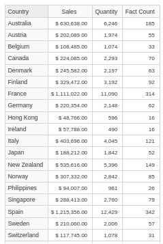

Value of all available measures (Sales, Quantity, Fact Count) per country 

## Slicing

14. 
Query:
```
SELECT Measures.Members ON COLUMNS,
    Time.Year.Members ON ROWS
FROM Orders
WHERE Customer.Country.Italy
```
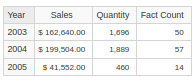

Value of all available measures per year 

15. 
Query:
```
SELECT Measures.Members ON COLUMNS,
 Time.Year.Members ON ROWS
FROM Orders
WHERE (Customer.Country.Italy, Product.[Product Line].[Classic Cars])
```
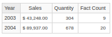

Value of all available measures per year, only for country italy and product line classic cars

16. 
Query:
```
SELECT Measures.Members ON COLUMNS,
 Time.Year.Members ON ROWS
FROM Orders
WHERE {(Customer.Country.Italy, Product.[Product Line].[Classic Cars]),
 (Customer.Country.France, Product.[Product Line].[Classic Cars])}
```
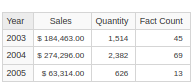

Value of all available measures per year, only for countries italy + France and product line classic cars

17. 
Query:
```
SELECT Time.Year.Members ON COLUMNS,
 Customer.Country.Members ON ROWS
FROM Orders
WHERE (Measures.Sales, Product.[Product Line].[Classic Cars])
```
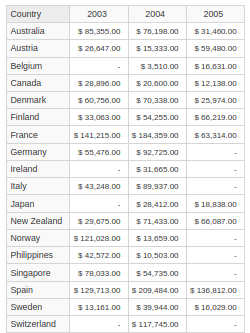

Value of measure Sales on orders, per country, for every year, for product line classic cars

## Navigation

18. 
Query:
```
SELECT Time.[2003].Children ON COLUMNS,
 Customer.Country.Members ON ROWS
FROM Orders
WHERE Measures.Sales
```
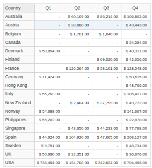

Value of measure Sales on orders, per country, for every direct sub-section (quarter) of year 2003

19. 
Query:
```
SELECT Time.[2003].Children ON COLUMNS,
 {Customer.Country.France, Customer.Country.Italy} ON ROWS
FROM Orders
WHERE Measures.Sales
```
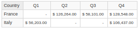

Value of measure Sales on orders, for only countries France and Italy, for every direct sub-section (quarter) of year 2003 

20. 
Query:
```
SELECT Time.[2003].Children ON COLUMNS,
{Customer.Country.Germany.Children,
Customer.Country.Italy.Children} ON ROWS
FROM Orders
WHERE Measures.Sales
```
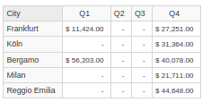

Value of measure Sales on orders, for only the direct sub-sections (city) of countries France and Italy, for every direct sub-section (quarter) of year 2003 

!!!
21. 
Query:
```
SELECT Time.[2003].Children ON COLUMNS,
 {DRILLDOWNLEVEL(Customer.Country.Germany),
 DRILLDOWNLEVEL(Customer.Country.Italy)} ON ROWS
FROM Orders
WHERE Measures.Sales
```
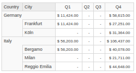

Same as #20, but include the original section (country)

22. 
Query:
```
SELECT Time.[2003].Children ON COLUMNS,
 DESCENDANTS(Customer.Italy, Customer.City, SELF) ON ROWS
FROM Orders
WHERE Measures.Sales
```
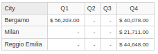

Value of measure Sales on orders, for only the direct descendants (city) of country Italy, for every direct sub-section (quarter) of year 2003 


23. 
Query:
```
SELECT Time.[2003].Children ON COLUMNS,
 DESCENDANTS(Customer.Italy, Customer.City, BEFORE) ON ROWS
FROM Orders
WHERE Measures.Sales
```
- BEFORE
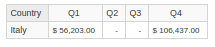

Same as #20 but with the descendants of the sub-section before country Italy (which is country Italy itself)

- SELF_AND_BEFORE !!!

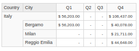

Similar to #21 (Drill down)

- AFTER

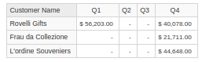


- SELF_AND_AFTER

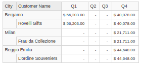


- BEFORE_AND_AFTER

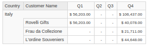


- SELF_BEFORE_AFTER

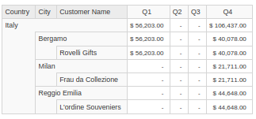


24. 
Query:
```
SELECT Time.[2003].Children ON COLUMNS,
 ASCENDANTS(Customer.City.Milan) ON ROWS
FROM Orders
WHERE Measures.Sales
```
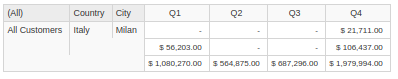


25. 
Query:
```
SELECT Time.[2003].Children ON COLUMNS,
 ANCESTOR(Customer.City.Milan, Customer.Country) ON ROWS
FROM Orders
WHERE Measures.Sales
```
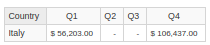


## Cross Join

26. 

27. 
Query:
```
SELECT Product.[Product Line].Members ON COLUMNS,
 CROSSJOIN(Customer.Country.Members, Time.Year.Members) ON ROWS
FROM Orders
WHERE Measures.Sales
```
```
SELECT Product.[Product Line].Members ON COLUMNS,
 Customer.Country.Members * Time.Year.Members ON ROWS
FROM Orders
WHERE Measures.Sales
```

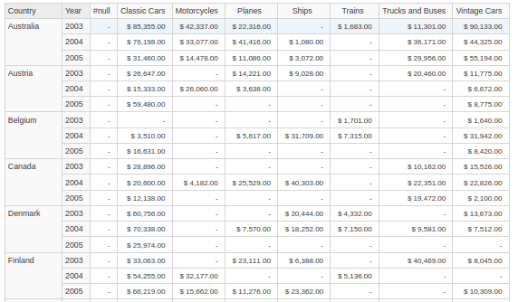


## Calculated Members

28. 
Query:
```
WITH MEMBER Measures.SalesPerUnit AS (Measures.Sales / Measures.Quantity)
SELECT Measures.SalesPerUnit ON COLUMNS,
 Customer.Country.Members ON ROWS
FROM Orders
```
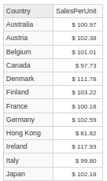


29. 
Query:
```
WITH MEMBER Measures.SalesPerUnit AS (Measures.Sales / Measures.Quantity)
SELECT Measures.AllMembers ON COLUMNS,
 Customer.Country.Members ON ROWS
FROM Orders
```
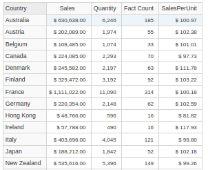


31. 

32. 
Query:
```
WITH MEMBER Measures.Cars AS Product.[Product Line].[Classic Cars] +
 Product.[Product Line].[Vintage Cars]
SELECT Time.Year.Members ON COLUMNS,
 Measures.Cars ON ROWS
FROM Orders
```
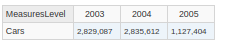


- Measures.Cars AS Product.[Product Line].[Classic Cars]

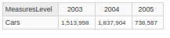


- Measures.Cars AS Product.[Product Line].[Vintage Cars]

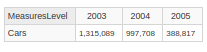


## Named Sets

33. 
Query:
```
WITH SET [Nordic Countries] AS {Customer.Country.Denmark,
 Customer.Country.Finland,
 Customer.Country.Norway, 
 Customer.Country.Sweden}
SELECT Time.Year.Members ON COLUMNS,
 [Nordic Countries] ON ROWS
FROM Orders
WHERE Measures.Sales
```
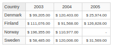


34. 
Query:
```
WITH SET TopCountries AS TOPCOUNT(Customer.Country.Members, 3, Measures.Sales)
SELECT Measures.Members ON COLUMNS,
 TopCountries ON ROWS
FROM Orders
```
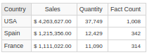


## Relative Navigation

35. 
Query:
```
WITH MEMBER Measures.PercentSales AS
 (Measures.Sales, Customer.Country.CurrentMember) /
 (Measures.Sales, Customer.Country.CurrentMember.Parent),
 FORMAT_STRING = '#0.00%'
SELECT {Measures.Sales, Measures.PercentSales} ON COLUMNS,
 Customer.Country.Members ON ROWS
FROM Orders
```
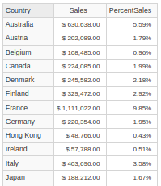


36. 
Query:
```
SELECT Time.Year.Members ON COLUMNS,
 GENERATE({Customer.Country.Belgium, Customer.Country.France},
 DESCENDANTS(Customer.CurrentMember, Customer.City)) ON ROWS 
FROM Orders
WHERE Measures.Sales
```
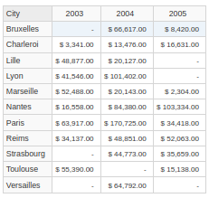


37. 
Query:
```
WITH MEMBER Measures.[Previous Month] AS Time.Month.CurrentMember.PrevMember
MEMBER Measures.[Sales Growth] AS Measures.Sales -
Measures.[Previous Month]
SELECT {Measures.Sales,
Measures.[Previous Month],
Measures.[Sales Growth]} ON COLUMNS,
DESCENDANTS(Time.Year.[2004], Time.Month) ON ROWS
FROM Orders
```
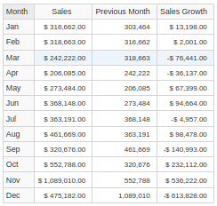


38. 
Query:
```
WITH MEMBER Measures.[Previous Year] AS PARALLELPERIOD(Time.Month, 12)
 MEMBER Measures.[Sales Growth] AS Measures.Sales -
 Measures.[Previous Year]
SELECT {Measures.Sales,
 Measures.[Previous Year],
 Measures.[Sales Growth]} ON COLUMNS,
 DESCENDANTS(Time.Year.[2004], Time.Month) ON ROWS
FROM Orders
```
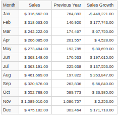


## Filtering

40. 
Query:
```
SELECT Measures.Members ON COLUMNS,
 FILTER(Customer.Country.Members, Measures.Sales > 1000000) ON ROWS
FROM Orders
```
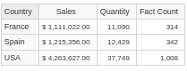


41. 
Query:
```
SELECT Time.Year.Members ON COLUMNS,
 FILTER(Customer.Country.Members,
 (Measures.Sales, Time.[2004]) > 250000) ON ROWS
FROM Orders
WHERE Measures.Sales
```
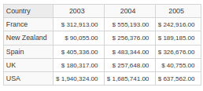


42. 
Query:
```
SELECT Measures.Members ON COLUMNS,
 Customer.Country.Members ON ROWS
FROM Orders
```
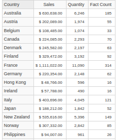


43. 
Query:
```
SELECT Measures.Members ON COLUMNS,
 ORDER(Customer.Country.Members, Measures.Sales, DESC) ON ROWS
FROM Orders
```
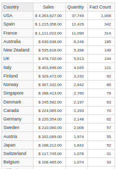

44. 

45. 

46. 
Query:
```
SELECT Measures.Members ON COLUMNS,
 HEAD(ORDER(Customer.Country.Members, Measures.Sales, DESC), 3) ON ROWS
FROM Orders
```

```
SELECT Measures.Members ON COLUMNS,
 TOPCOUNT(Customer.Country.Members, 3, Measures.Sales) ON ROWS
FROM Orders
```

```
SELECT Measures.Members ON COLUMNS,
 TOPPERCENT(Customer.Country.Members, 50, Measures.Sales) ON ROWS
FROM Orders
```

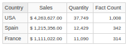
